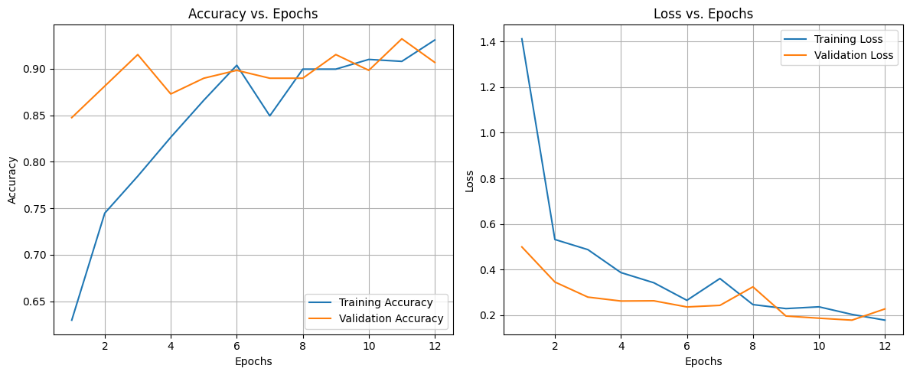

## 📊 *AI-Powered Image Classifier for Pet Identification*

## Overview

In an increasingly digital and visual world, businesses are seeking intelligent solutions to automatically categorize and filter vast amounts of image data. This project addresses that need by developing an AI-powered image classification system that distinguishes between cats and dogs using Convolutional Neural Networks (CNNs). While the use case may appear simple, the underlying technology has broad implications for industries such as:

* **Veterinary & Health Tech:** Streamline intake or diagnostic processes by classifying uploaded pet images.
* **Content Platforms & Social Media:** Enable automated moderation, tagging, or personalized content recommendations based on pet types.
* **Smart Home & IoT Devices:** Support intelligent pet monitoring systems that recognize animals captured by smart cameras.

This project demonstrates how deep learning can solve real-world classification problems with high accuracy and reliability. By combining cutting-edge AI with a user-friendly deployment pipeline (Docker + AWS), this solution proves the viability of scalable, cloud-based image recognition platforms — opening doors for monetizable products, services, or SaaS integrations in the pet tech and broader image intelligence market.

## 🏢 Business Value

This AI-powered cat vs. dog image classifier delivers real-world value for organizations working with animal identification and welfare:

- **Stray Animal Identification:**  
  Enables municipalities, animal shelters, and NGOs to quickly and accurately identify stray cats and dogs from images. This supports rescue operations, adoption drives, and population management efforts.

- **Operational Efficiency:**  
  Automates the sorting and cataloging of animal images, reducing manual labor and minimizing human error. Staff can focus on higher-value tasks, improving overall workflow efficiency.

- **Data-Driven Decision Making:**  
  Facilitates the collection and analysis of statistics on stray animal populations, helping organizations allocate resources more effectively and plan targeted interventions.

- **Scalability:**  
  The automated approach can be deployed across multiple locations or integrated into mobile apps for field workers, scaling animal identification efforts city- or nation-wide.

By leveraging deep learning for pet identification, this project empowers animal welfare organizations and smart city initiatives to make faster, more impactful decisions.

---
### 📷 Example Outputs

<p align="center">
  <br>
  <em>Figure 1: Training and validation accuracy/loss curves for the cat vs. dog classifier. These curves illustrate the model’s learning dynamics and can reveal signs of overfitting or underfitting. Note: This result was obtained <strong>without</strong> applying extra augmentation to cat images.<em>
</p>

<p align="center">
  <br>
  <em>Figure 2: Training and validation accuracy/loss curves for the cat vs. dog classifier. These curves illustrate the model’s learning dynamics and can reveal signs of overfitting or underfitting. Note: This result was obtained <strong>after</strong> applying extra augmentation to cat images.</em>
</p>

<p align="center">
  <br>
  <em>Figure 3: Training and validation accuracy/loss curves over epochs.</em>
</p>

<p align="center">
  <br>
  <em>Figure 4: ROC curve showing model discrimination ability between cats and dogs.</em>
</p>

---

## 🚀 How to Run in Google Colab

Running this project in **Google Colab** is a great way to leverage free GPU resources, which can significantly speed up model training and experimentation—especially if you don't have a powerful local machine. Colab also provides a convenient, cloud-based environment where you can run Jupyter notebooks interactively without any setup hassles.

### **Why Use Google Colab?**
- **Free GPU/TPU Access:** Accelerate deep learning training and inference.
- **No Local Setup Required:** Avoid dependency and hardware issues.
- **Easy Collaboration:** Share and edit notebooks with others in real time.
- **Persistent Storage:** Save your work directly to Google Drive.

---

### **Step-by-Step Instructions**

1. **Open Google Colab:**  
   Go to [https://colab.research.google.com/](https://colab.research.google.com/).

2. **Clone the Repository:**  
   In a new Colab notebook cell, run:
   ```python
   !git clone https://github.com/zkhechadoorian/CNNs_Cats_and_Dogs.git
   %cd CNNs_Cats_and_Dogs
   ```

3. **Install Dependencies:**  
   Install all required Python packages:
   ```python
   !pip install -r requirements.txt
   ```

4. **(Optional) Enable GPU:**  
   - Click `Runtime` > `Change runtime type` > Set "Hardware accelerator" to `GPU`.
   - This will make training much faster.

5. **Run the Notebooks:**  
   - In the Colab file browser (left sidebar), navigate to the `research/` directory.
   - Double-click any notebook (e.g., `st_01.ipynb`) to open it.
   - Run all cells sequentially.  
   - **Tip:** Follow the order: `st_01.ipynb` → `st_02.ipynb` → ... → `st_05.ipynb` for a smooth workflow.

6. **Save Your Work:**  
   - To keep your changes, go to `File > Save a copy in Drive`.
   - This will save an editable copy of the notebook to your Google Drive.

7. **(Optional) Run the Full Pipeline:**  
   If you want to execute the entire pipeline from start to finish, run:
   ```python
   !python main.py
   ```

---

**Note:**  
- You do **not** need to set up a virtual environment in Colab—each session is already isolated.
- If you want to edit and save multiple notebooks, consider cloning the repo into your Google Drive for persistent access:
   ```python
   from google.colab import drive
   drive.mount('/content/drive')
   !git clone https://github.com/zkhechadoorian/CNNs_Cats_and_Dogs.git /content/drive/MyDrive/CNNs_Cats_and_Dogs
   %cd /content/drive/MyDrive/CNNs_Cats_and_Dogs
   ```

---

Enjoy fast, hassle-free model training and experimentation with Google Colab!

---

## Project Structure: Cat vs Dog Image Classification (CNN with Docker)

```
Image-Classification/
│
├── app.py                         # FastAPI/Flask app entry point (API server)
├── home.py                        # Script for launching the home page
├── main.py                        # Entry point to trigger the training pipeline
├── template.py                    # Script to serve HTML templates
├── requirements.txt               # Python dependencies
├── Dockerfile                     # Docker container instructions
├── setup.py                       # Python package setup script
├── README.md                      # Project documentation
├── config/
│   └── config.yaml                # Global configuration file
├── params.yaml                    # Hyperparameters for model training
├── scores.json                    # Evaluation metrics (Accuracy, Precision, etc.)
├── logs/
│   └── running_logs.log           # Application/training logs
├── templates/
│   └── index.html                 # Frontend upload form for image prediction
│
├── artifacts/                     # Stores all outputs, checkpoints, and datasets
│   ├── data_ingestion/            # Contains raw dataset (unzipped & processed)
│   │   ├── data.zip
│   │   └── PetImages/
│   │       ├── Cat/               # Cat images
│   │       └── Dog/               # Dog images
│   ├── prepare_base_model/       # Saved base CNN model and updated model
│   │   ├── base_model.h5
│   │   └── base_model_updated.h5
│   ├── prepare_callbacks/        # TensorBoard logs & model checkpoints
│   │   ├── checkpoint_dir/
│   │   └── tensorboard_log_dir/
│   └── training/                 # Final trained model
│       └── model.h5
│
├── src/
│   └── ImageClassification/      # Python package with modular components
│       ├── __init__.py
│       ├── components/           # Core ML pipeline logic
│       │   ├── data_ingestion.py
│       │   ├── prepare_base_model.py
│       │   ├── prepare_callback.py
│       │   ├── training.py
│       │   └── evaluation.py
│       ├── config/               # Configuration management
│       │   └── configuration.py
│       ├── constants/            # Constants used across the code
│       ├── entity/               # Config entity dataclasses
│       ├── pipeline/             # Execution stages for MLOps pipeline
│       │   ├── stage_01_data_ingestion.py
│       │   ├── stage_02_prepare_base_model.py
│       │   ├── stage_03_training.py
│       │   ├── stage_04_evaluation.py
│       │   └── predict.py        # Prediction logic
│       └── utils/                # Helper functions (e.g., common.py)
│
├── research/                     # Jupyter notebooks for prototyping & EDA
│   ├── pipe (2).jpg              # Architecture image used in documentation
│   ├── st_01.ipynb
│   ├── st_02.ipynb
│   ├── st_03.ipynb
│   ├── st_04.ipynb
│   └── st_05.ipynb
```

---
##  Setup and Installation Instructions


### 1. Create a virtual environment and activate it

```bash
python3.10 -m venv .venv
source .venv/bin/activate   # On Windows: .venv\Scripts\activate
```

### 2. Install dependencies

```bash
pip install -r requirements.txt
```
---

## Step-by-Step Guide

Perform exploratory research and build the initial model using Jupyter notebooks provided in the `research/` directory.

### 1. Run Data Exploration & Setup Notebooks

Follow the steps below to execute each notebook in order:

---

### 📘 `research/st_01.ipynb`

> **Purpose:** Initial data loading and exploration

* Open the notebook.
* Run **all cells** sequentially.

---
Data Ingestion Stage

This stage handles the **initial setup of the dataset** that your image classification model will use. It's the **first and most critical step** to ensure your data is downloaded, organized, and cleaned properly.

---
* The system first reads a **configuration file** that tells it **where to download the dataset from**, **where to store it locally**, and **which folders to use** to keep things organized.
* It makes sure all the folders it needs are **created** in your project directory.

---
* It checks whether the **dataset zip file already exists locally**.
* If not, it automatically **downloads it from the internet** using the URL defined in the config file.

---
* Once the dataset is downloaded, it **opens the zip file** and looks inside.
* It **filters out only the useful image files**, specifically those labeled as either **Cats** or **Dogs**.
* This ensures that only relevant image files (i.e., `.jpg` files from the Cat and Dog folders) are extracted.

---
* As it extracts each image, it checks whether the image file is **valid** (i.e., not empty or corrupted).
* If any image file is found to be **empty or broken**, it gets **deleted automatically** so it doesn’t cause problems during model training.

---
You’ll have a clean and organized folder structure containing:
* A local copy of the **Cats vs. Dogs image dataset**
* Subfolders neatly split between **Cat images** and **Dog images**
* Any broken or irrelevant files automatically removed
---

### 📘 `research/st_02.ipynb`

> **Purpose:** Prepare and configure the base model (VGG16) for transfer learning

* Open the notebook.
* Run **all cells** sequentially.

---

Prepare Base Model Stage

This stage sets up a **pre-trained image classification model** (VGG16) as the foundation for training on the Cats vs. Dogs dataset. The base model is loaded, modified, and saved in two versions — one as-is and one fully prepared for training.

---

* It begins by reading configuration settings that define **input image size**, **learning rate**, **number of classes**, and **whether to include the original top layers** from the pre-trained model.
* It ensures that all necessary directories for saving models are **automatically created** and structured properly.

---

* The base model (VGG16) is downloaded with **pre-trained weights** from ImageNet, excluding the top layers.
* This base model is then **saved to disk** for reference or reuse.

---

* A new model is built using this base by **freezing all layers** of VGG16 — meaning its internal weights are not updated during training.
* A **new classification head** is added on top, tailored to predict **two classes** (Cats and Dogs).
* This updated model is then **compiled** with a suitable loss function and optimizer, preparing it for training.

---

* The updated model — which combines the pre-trained base and the new custom head — is saved separately as the **fully prepared model**.
* This step ensures the system can move straight into training without needing to rebuild or recompile the model structure.

---

### 📘 `research/st_03.ipynb`

> **Purpose:** Set up training callbacks for logging and model checkpointing

* Open the notebook.
* Run **all cells** sequentially.

---

Prepare Callback Stage

This step configures helpful tools to **monitor and manage the training process** of your image classification model. These tools are essential for tracking performance and automatically saving the best version of your model during training.

---

* It starts by reading configuration files to determine **where logs should be saved** and **where the best version of the model should be stored**.
* The required folders for saving logs and model checkpoints are automatically **created and organized**.

---

* A logging system is set up using **TensorBoard**, which provides a **visual dashboard** during training.
* Each training session gets its own uniquely timestamped folder for **better traceability of results over time**.

---

* A **model checkpoint** mechanism is also created.
* This ensures that the **best version of the model (based on validation performance)** is saved automatically during training — avoiding any risk of losing progress.

---

* Both the TensorBoard logger and the checkpoint saver are **bundled together** into a callback list.
* These will later be passed into the model’s training process to **track metrics live** and **store optimal weights** without manual intervention.

---

### 📘 `research/st_04.ipynb`

> **Purpose:** Train the image classification model using prepared data and callbacks

* Open the notebook.
* Run **all cells** sequentially.

---

Training Stage

This is where the model **learns to classify images** by analyzing the dataset over several training cycles. It uses the **preprocessed data**, the **base model**, and the **callbacks** set up earlier.

---

* First, it loads the **latest version of the model** (with a custom classification layer added) and **compiles** it with the optimizer, loss function, and accuracy metric.
* This ensures the model is ready to learn from image data.

---

* The training and validation datasets are created using a **data generator**.
* 80% of the images are used for training, while 20% are held back for **validation**, so the model can be evaluated during training.

---

* If data augmentation is enabled, the training images are **randomly altered** using techniques like flipping, zooming, and shifting.
* This helps the model **generalize better** by seeing slightly varied versions of the same images.

---

* Once the data generators are ready, training begins.
* The model learns in **multiple rounds (epochs)** and evaluates its performance on the validation set after each round.

---

* Throughout training, the system keeps track of:

  * **How the model is performing**, via TensorBoard logs.
  * **The best version of the model**, by saving it automatically whenever it improves.
---

### 📘 `research/st_05.ipynb`

> **Purpose:** Evaluate the performance of the trained image classification model

* Open the notebook.
* Run **all cells** sequentially.

---

Model Evaluation Stage

This step assesses how well the model performs on new data it hasn’t seen during training. It's essential to understand the model's **accuracy** and **reliability** before using it in production.

---

* The system first loads the **final trained model** from the saved location.
* It also reads configuration settings like **image size**, **batch size**, and the path to the evaluation dataset.

---

* A **validation dataset** is created from 30% of the original data.
* The images are automatically **rescaled** and **prepared** so they can be used to test the model’s performance.

---

* Once the validation dataset is ready, the model is run against it.
* The model generates predictions for each image and compares them to the actual labels.
* This allows it to calculate the **loss** and **accuracy** of the model.

---

* After evaluation, the system **stores the results** (loss and accuracy) in a `scores.json` file.
* This makes it easier to keep track of how well the model performed and to use these metrics later for reporting or comparison.

---

### 📘 `main.py`

> **Purpose:** Executes the entire image classification pipeline from start to finish.

* Open the terminal.
* Make sure your virtual environment is activated.
* Run this file using:

  ```bash
  python main.py
  ```

---

Full Pipeline Orchestration

This script ties together all the independent pipeline stages and runs them one by one. It ensures each step of the process is completed in sequence so the model is trained and evaluated properly.

---

* The first section starts the **Data Ingestion** phase.
* It downloads the dataset (if not already present), unzips it, and filters out only valid cat and dog images.

---

* Next, it triggers the **Base Model Preparation** step.
* A pre-trained VGG16 model is loaded, frozen, and a custom classification head is added.
* The updated model is saved for training.

---

* The script then initiates the **Training** phase.
* Data is augmented and split into training and validation sets.
* The model is trained using callbacks like ModelCheckpoint and TensorBoard.
* At the end, the trained model is saved for future use.
---

After running this script, you’ll have:

* A clean and preprocessed dataset.
* A fine-tuned version of the VGG16 model.
* A trained model saved to disk.
---


### 📘 `app.py`

> **Purpose:** This is the **Flask web application** that powers the interface for uploading an image, triggering model training, and making predictions on images using the trained Cat vs. Dog classifier.

---
To run the app:

```bash
python app.py
```

Then access it via:

```
http://localhost:5001/
```

This Flask server is now ready to handle training and predictions with just API calls or a web interface.

---

* A **Flask server** to host the app.
* Enables **CORS (Cross-Origin Resource Sharing)** so it can interact with frontend applications hosted elsewhere (e.g., React, Angular).
* Prepares environment settings needed for UTF-8 character encoding.

---

* A class called `ClientApp` is initialized.
* This class loads your model and sets up a filename (`inputImage.jpg`) that will temporarily hold any image a user uploads for prediction.

---

* This route renders a simple HTML page (likely with a form or interface for uploading an image or triggering actions).
* It serves as the frontend homepage for users.

---

* When this route is accessed (via GET or POST), it runs the training pipeline by executing the `main.py` script.
* Once training is complete, it returns a message saying that training was successful.
* This is useful for retraining or fine-tuning the model on demand.

---
* This is where image prediction happens:

  * It accepts a **base64-encoded image** from the client.
  * It decodes the image and saves it temporarily.
  * The model processes the image and returns a prediction — either **Cat** or **Dog**.
* The result is sent back to the client as a JSON response.
---

### 📘 home.py

**Purpose:** This is the Streamlit web application that provides a clean UI for classifying uploaded images as either Cat or Dog using a trained CNN model.

---

To launch the Streamlit app locally:

```bash
streamlit run home.py
```

Then visit the following URL in your browser:

```
http://localhost:8501/
```

Your Cat vs Dog image classifier is now live and ready to accept image uploads for prediction.

---

* Loads a pre-trained Keras CNN model from `artifacts/training/model.h5`.
* Initializes a Streamlit interface with:

  * A file uploader for image inputs.
  * A slider to control image input size.
  * Visual and statistical display of predictions.

---

* A TensorFlow/Keras model is loaded and cached using `@st.cache` to avoid repeated reloads.
* The app displays:

  * Project title
  * Detailed markdown documentation including:

    * Overview, motivation, success metrics
    * Dataset, methodology, pipeline, and architecture
    * Deployment approach with Docker and AWS

---

* Users can upload `.jpg`, `.png`, or `.jpeg` images.
* A sidebar slider lets users select input image size (default: 224).
* Once an image is uploaded:

  * It’s displayed within the app.
  * It’s resized and preprocessed.
  * The model predicts whether it’s a Cat or Dog.

---

* Uploaded images are resized using `ImageOps.fit()` and converted to NumPy arrays.
* The CNN model processes the image and returns probabilities for both classes.
* Results shown:

  * Predicted label (Cat/Dog)
  * Probability % for each class
  * Max probability
  * Sanity check on sum of probabilities

---

* A ready-to-use browser-based image classification app.
* All predictions happen locally (no cloud dependency).
* Ideal for prototyping, demos, or showcasing ML skills.

---

### ▶️ To run the app locally with Docker:

```bash
docker build -t image-classification .
docker run -it --rm image-classification
```

If your app requires AWS access (e.g., for downloading images or models), include AWS credentials:

```bash
docker run -it --rm -v ~/.aws:/root/.aws image-classification
```

This command will launch the Python script inside a clean containerized environment.

---
## Results
The Cat vs Dog classification system was developed using a transfer learning approach based on the VGG16 architecture with frozen convolutional layers and a custom classification head. The model was trained on a small dataset (318 training images and 78 validation images), achieving a validation accuracy of approximately **60.94%** after 5 epochs. While the training accuracy fluctuated (ranging between 37% and 55%), the model showed signs of underfitting, likely due to limited data and minimal fine-tuning (only 6 trainable parameters). Additionally, during evaluation, a critical mismatch occurred between the ground truth labels and the model's output shape—`target.shape=(16, 1)` vs. `output.shape=(16, 2)`—indicating an incompatibility between binary labels (used in the generator) and the model expecting one-hot encoded vectors for categorical cross-entropy. This suggests a misalignment in either the data pipeline (binary vs categorical classification mode) or the loss function setup. Despite these issues, the model pipeline from ingestion to training ran successfully and demonstrates a complete ML lifecycle with Dockerized infrastructure, but would benefit significantly from increasing dataset size, unfreezing layers for fine-tuning, and aligning the evaluation strategy for robust performance measurement.

---

## Deploy to server

[See detailed deployment steps in `server-instructions.md`](server-instructions.md)